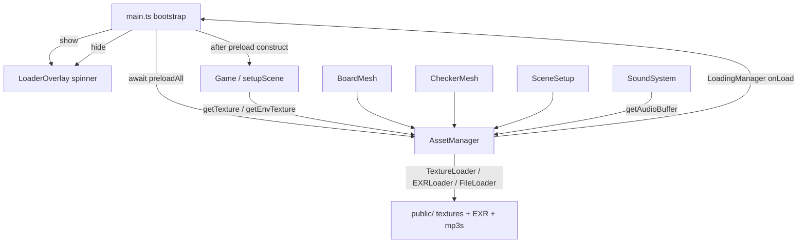

# Requirements

### Overview & Goals
Today the Chapayev game downloads its 3D assets ad‑hoc, scattered across several rendering modules: each of `BoardMesh.ts`, `CheckerMesh.ts`, and `SceneSetup.ts` creates its own `new THREE.TextureLoader()` and independently issues texture requests, and the HDR environment is loaded separately via `EXRLoader`. There is no single place that knows what needs to be downloaded, no way to know when everything is ready, and no loading feedback for the user — the scene simply pops textures in as they arrive.

This change introduces a **centralized AssetManager** that owns the download of all textures (the wood JPG maps for board, deck, and both checker sets), the EXR HDR environment map, **and every mp3 sound file** (hit/movement/rim/fall-off variants + background music), and a **loading indicator** (spinner) that is displayed until every asset has finished downloading.

### Scope

**In Scope**
- A single `AssetManager` that centralizes downloading of all GPU textures, the HDR environment map, and all mp3 sound files, backed by one `THREE.LoadingManager`.
- A central asset manifest listing every texture/EXR path **and every mp3 sound path** (replacing the hardcoded paths currently duplicated across rendering files and `SoundSystem.ts`).
- Refactoring `BoardMesh.ts`, `CheckerMesh.ts`, and `SceneSetup.ts` to consume already‑downloaded textures from the AssetManager cache instead of creating their own loaders.
- Refactoring `SoundSystem.ts` so its phase‑1 raw `fetch(...)` of mp3 ArrayBuffers is replaced by reads from the AssetManager cache (audio **decoding** stays in `SoundSystem`, gated on the user‑gesture AudioContext unlock).
- A loading indicator (indeterminate spinner overlay) shown during startup and hidden only after all assets are downloaded.
- Wiring the preload + loader into the startup flow in `main.ts` so assets are fully downloaded before the game scene is built.

**Out of Scope**
- Any change to how audio is **decoded/unlocked** — the iOS Safari gesture-driven `AudioContext` unlock and `decodeAudioData` flow in `SoundSystem` stays exactly as-is; only the raw byte download moves to the AssetManager.
- Playback logic (BGM cross-fade, movement/sliding sounds, volume/gain nodes) is unchanged.
- No visual redesign of the game itself; the loader is a minimal themed spinner, no percentage.
- No changes to networking, matchmaking, or gameplay logic.

### User Stories
- As a player, when I open the game I see a loading spinner instead of a half‑textured scene, so I know the game is preparing.
- As a player, I only see the interactive board once all textures and the environment map are downloaded, so the scene never pops in visibly.
- As a developer, I have one place (`AssetManager` + manifest) that defines and downloads all visual assets, so adding or changing a texture no longer means touching multiple loaders.

### Functional Requirements
- All textures currently loaded in `BoardMesh`, `CheckerMesh`, and `SceneSetup`, the EXR HDR env map, **and all mp3 sound files** are downloaded through the AssetManager.
- The loading indicator appears at startup, before the 3D scene becomes visible.
- The indicator remains visible until the AssetManager reports that every asset (textures + EXR + mp3s) finished downloading, then is removed/hidden.
- Rendering code retrieves textures synchronously from the AssetManager cache; `SoundSystem` retrieves its raw mp3 ArrayBuffers from the cache. No rendering or sound module issues its own network request for these assets anymore.
- If an asset fails to download, startup still proceeds (the game does not hang forever on the spinner) and the failure is logged, consistent with existing error handling in `main.ts` (`reportStartupError`).

### Non-Functional Requirements
- No duplicate downloads: each texture/mp3 URL is requested exactly once and reused (e.g. `hit_04.mp3` is used for both hit and rim-hit).
- Works across all existing platform adapters (Telegram/Yandex/Capacitor/Standalone) since the loader is plain HTML overlay in `#ui-root`, consistent with the existing UI layer.
- Keeps the existing `firstFrameRendered` → `adapter.ready()` contract intact.

# Technical Design

### Current Implementation
- **Texture loading is decentralized.** `chapaev/src/rendering/BoardMesh.ts` (deck + board square maps), `chapaev/src/rendering/CheckerMesh.ts` (bright/dark checker maps, cached per team in a `materialCache`), and `chapaev/src/rendering/SceneSetup.ts` (table maps + EXR HDR via `EXRLoader` + `PMREMGenerator`) each construct their own `new THREE.TextureLoader()` and call `.load(publicAssetUrl(...))`.
- **URL resolution** goes through `chapaev/src/publicAssetUrl.ts` for all `public/` assets.
- **Startup flow:** `chapaev/src/main.ts` `bootstrap()` detects platform, then constructs `new Game(canvas, adapter, mode)`. The `Game` constructor immediately calls `setupScene(canvas)` (which kicks off texture/EXR loads) and `game.start()`. `game.firstFrameRendered` resolves after the first rendered frame; `main.ts` then calls `adapter.ready()` to hide the platform splash.
- **UI layer:** `chapaev/src/ui/UIManager.ts` manages HTML overlay screens inside `#ui-root`; styles live in `chapaev/src/ui/styles/ui.css` (imported by `UIManager`). Panels use `panel-enter`/`panel-exit` animations.
- **Assets on disk:** `chapaev/public/textures/{deck,boards,bright-checker,dark-checker,env}/...` (JPG maps + one `.exr`), enumerated during investigation.

### Key Decisions
- **Single `THREE.LoadingManager` inside an `AssetManager`** (confirmed). The manager owns shared `TextureLoader` + `EXRLoader` **+ `FileLoader`** instances bound to one `LoadingManager`; its `onLoad`/`onError` callbacks resolve a `preloadAll()` promise, and consumers read finished assets from a cache map. This is the idiomatic three.js approach and gives an accurate "all done" signal for the loader.
- **Indeterminate spinner, no percentage** (confirmed). Simpler UX; avoids the jitter of three.js progress counts (which grow as items register).
- **Textures + HDR env + mp3s** (confirmed). All three asset kinds route through the AssetManager.
- **mp3s downloaded via `THREE.FileLoader` (responseType `arraybuffer`), decoded in `SoundSystem`.** `FileLoader` is tracked by the same `LoadingManager`, so audio bytes count toward the same "all downloaded" signal that drives the spinner. Decoding (`AudioContext.decodeAudioData`) must stay in `SoundSystem` because it is gated on the iOS-Safari user-gesture unlock and needs the `AudioContext`. So the AssetManager owns **download** of mp3 bytes; `SoundSystem` owns **decode/playback** and reads raw `ArrayBuffer`s from the cache.
- **Preload before building the scene.** `main.ts` awaits `assetManager.preloadAll()` (showing the spinner) and only then constructs `Game`, so `setupScene`/meshes can pull textures synchronously from the cache. The EXR is downloaded by the AssetManager, but PMREM env‑map generation stays in `SceneSetup` (it needs the `WebGLRenderer`, which is created inside `setupScene`).
- **Per‑use texture settings via cloning.** Some maps are reused with different `repeat`/`wrapping` (e.g. table uses `repeat 6`, deck uses `repeat 2`, both reference `boards/Wood076...`). The cache stores one downloaded texture per URL; call sites that need different tiling `.clone()` the cached texture (clone shares the GPU image, so no re‑download) and set `wrapS/wrapT/repeat/colorSpace` locally.

### Proposed Changes
1. **`chapaev/src/rendering/AssetManifest.ts` (new)** — export a typed manifest of every texture/EXR path (grouped: `deck`, `board`, `brightChecker`, `darkChecker`, `env`) **plus an `AUDIO_MANIFEST` listing every mp3 path** (hit/movement/rim/fall-off/bgm), using the same relative paths currently hardcoded in the rendering modules and `SoundSystem.ts`. Single source of truth for what gets downloaded.
2. **`chapaev/src/rendering/AssetManager.ts` (new)** — a small class/singleton:
   - Holds one `THREE.LoadingManager`, a shared `THREE.TextureLoader`, an `EXRLoader`, **and a `THREE.FileLoader` (responseType `arraybuffer`) for mp3 bytes**.
   - `preloadAll(): Promise<void>` — iterates the texture, EXR, **and audio** manifests, calls the appropriate loader for each entry, stores results in a `Map<string, THREE.Texture>` and a `Map<string, ArrayBuffer>`, and resolves when `LoadingManager.onLoad` fires (or rejects/logs on `onError`). Color‑space (`SRGBColorSpace` for color maps) is applied on load.
   - `getTexture(path): THREE.Texture` / `getEnvTexture(): THREE.DataTexture` / **`getAudioBuffer(path): ArrayBuffer`** — synchronous cache accessors used by rendering and sound code; throw/warn if called before preload.
   - `dispose()` for cleanup symmetry.
3. **Refactor rendering consumers** to read from the AssetManager cache instead of `new THREE.TextureLoader()`:
   - `BoardMesh.ts` — replace deck/board `.load(...)` calls with `assetManager.getTexture(...)` (clone + set `repeat 2,2` for deck; board squares keep existing settings).
   - `CheckerMesh.ts` — `getCheckerMaterial` pulls bright/dark maps from the cache (materials still cached per team as today).
   - `SceneSetup.ts` — table maps from cache (clone + `repeat 6`); EXR obtained via `assetManager.getEnvTexture()` and fed into the existing `PMREMGenerator` block (env map generation stays synchronous now that the EXR is already downloaded, replacing the async `EXRLoader().load(...)` callback).
4. **`chapaev/src/systems/SoundSystem.ts` (modified)** — replace the phase‑1 `loadSounds()` block of `fetch(publicAssetUrl(...)).arrayBuffer()` calls with `assetManager.getAudioBuffer(path)` reads from the cache for `HIT_SOUND_PATHS`, `MOVEMENT_SOUND_PATH`, `RIM_HIT_SOUND_PATH`, `FALL_OFF_SOUND_PATHS`, and `BGM_SOUND_PATHS`; set `rawHitBuffers`/`rawMovementBuffer`/`rawRimHitBuffer`/`rawFallOffBuffers`/`rawBgmBuffers` from the cache, mark `fetched = true`, and keep the entire `addUnlockListeners()` → `decodeBuffers()` gesture flow untouched. The sound path constants move into (or are re‑exported from) the manifest so both AssetManager and SoundSystem share one source of truth.
5. **`chapaev/src/ui/LoaderOverlay.ts` (new)** — a tiny HTML overlay (spinner + optional "Loading…" label) appended to `#ui-root`, with `show()`/`hide()` methods. Styles added to `chapaev/src/ui/styles/ui.css` (keyframe spinner consistent with existing panel styling). Kept independent of `UIManager`'s `Screen` enum since it exists before/around the game lifecycle.
6. **`chapaev/src/main.ts`** — in `bootstrap()`, after adapter init: create + `show()` the loader overlay, `await assetManager.preloadAll()`, then construct `Game` and `game.start()`, and `hide()` the loader (either right after preload or gated on `firstFrameRendered` for a seamless handoff). Errors from preload are funneled through the existing `reportStartupError`/catch path so the spinner never hangs indefinitely.

### Data Models / Contracts
```ts
// AssetManifest.ts
export interface TextureAsset { path: string; colorSpace?: 'srgb' | 'linear'; }
export const TEXTURE_MANIFEST: readonly TextureAsset[];
export const ENV_MAP_PATH: string;               // '.../IndoorEnvironmentHDRI013_2K_HDR.exr'
export const AUDIO_MANIFEST: readonly string[];  // all mp3 paths (hit/movement/rim/fall-off/bgm)

// AssetManager.ts
export class AssetManager {
  preloadAll(): Promise<void>;
  getTexture(path: string): THREE.Texture;      // cached, throws if missing
  getEnvTexture(): THREE.DataTexture;           // cached EXR
  getAudioBuffer(path: string): ArrayBuffer;    // cached raw mp3 bytes (via FileLoader)
  dispose(): void;
}
export const assetManager: AssetManager;         // shared singleton
```

### Components
- **AssetManager (new, logic):** owns `LoadingManager` + loaders + cache; single download authority.
- **AssetManifest (new, data):** declarative list of asset paths.
- **LoaderOverlay (new, UI):** spinner overlay in `#ui-root`.
- **BoardMesh / CheckerMesh / SceneSetup (existing, modified):** now texture-cache consumers; no own loaders.
- **SoundSystem (existing, modified):** phase‑1 fetch replaced by reads of raw mp3 bytes from the cache; decode/unlock/playback unchanged.
- **main.ts (existing, modified):** orchestrates preload + loader show/hide around `Game` construction.

### File Structure
```
chapaev/src/
  rendering/
    AssetManifest.ts     (new)
    AssetManager.ts      (new)
    BoardMesh.ts         (modified)
    CheckerMesh.ts       (modified)
    SceneSetup.ts        (modified)
    index.ts             (modified – export AssetManager/manifest)
  systems/
    SoundSystem.ts       (modified – read raw mp3 bytes from cache)
  ui/
    LoaderOverlay.ts     (new)
    styles/ui.css        (modified – spinner styles)
  main.ts                (modified – preload + loader wiring)
```

### Architecture Diagram


### Risks
- **Shared texture settings.** Reusing one cached texture with different `repeat`/`wrapping` requires `.clone()` at call sites that tile differently (table vs deck vs board). Mitigation: clone shares the underlying image (no extra download) and set wrap/repeat/colorSpace per use.
- **EXR + PMREM ordering.** PMREM env‑map generation needs the renderer created in `setupScene`; keep generation there, only move the *download* to AssetManager. Mitigation: `getEnvTexture()` returns the already‑downloaded EXR, consumed synchronously in the existing PMREM block.
- **Headless/test paths.** `AimingVisuals.ts` builds procedural canvas/DataTextures with a headless fallback; leave those untouched (not downloaded assets).
- **Spinner hang on failure.** Ensure `preloadAll()` rejects/settles on `onError` so `main.ts` always proceeds and hides the loader.
- **Audio decode timing (iOS Safari).** Downloading mp3 bytes early must NOT trigger decode before the user-gesture `AudioContext` unlock. Mitigation: AssetManager only fetches raw `ArrayBuffer`s; `SoundSystem` keeps its existing `fetched`→`addUnlockListeners()`→`decodeBuffers()` sequence, just sourcing the bytes from the cache.
- **ArrayBuffer consumption.** `decodeAudioData` consumes the buffer; `SoundSystem` already `.slice(0)`s before decoding, so cached buffers stay reusable across context re-creation.

# Delivery Steps

###   Step 1: Add central asset manifest and AssetManager
A single AssetManager downloads all textures, the EXR HDR env map, and all mp3 sound files through one THREE.LoadingManager and exposes them from a cache.

- Create `chapaev/src/rendering/AssetManifest.ts` listing every texture path (deck, board, bright-checker, dark-checker), the EXR env path, and an `AUDIO_MANIFEST` of every mp3 path (hit/movement/rim/fall-off/bgm), mirroring the paths currently hardcoded in the rendering modules and `SoundSystem.ts`, with color-space hints for color maps.
- Create `chapaev/src/rendering/AssetManager.ts` with one `THREE.LoadingManager`, a shared `TextureLoader`, `EXRLoader`, and `FileLoader` (arraybuffer), a `Map<string, THREE.Texture>` texture cache and a `Map<string, ArrayBuffer>` audio cache, and:
  - `preloadAll()` that loads all texture, EXR, and audio manifest entries and resolves on `LoadingManager.onLoad` (logging/rejecting on `onError`).
  - synchronous `getTexture(path)`, `getEnvTexture()`, and `getAudioBuffer(path)` accessors.
  - `dispose()` and a shared singleton export.
- Export the new modules from `chapaev/src/rendering/index.ts`.

###   Step 2: Refactor rendering modules to consume the cache
BoardMesh, CheckerMesh, and SceneSetup use already-downloaded textures from AssetManager instead of creating their own loaders.

- `BoardMesh.ts`: replace `new THREE.TextureLoader().load(...)` calls with `assetManager.getTexture(...)`; clone + set `repeat 2,2`/wrapping for the deck maps and keep board-square settings/color-space.
- `CheckerMesh.ts`: update `getCheckerMaterial` to read bright/dark maps from the cache (retain the per-team `materialCache`) and apply `SRGBColorSpace` on color maps.
- `SceneSetup.ts`: pull table maps from the cache (clone + `repeat 6`, wrapping, aoMap uv1 unchanged) and replace the async `EXRLoader().load(...)` callback with `assetManager.getEnvTexture()` fed synchronously into the existing `PMREMGenerator` block.
- Verify no rendering module still constructs its own `TextureLoader`/`EXRLoader` for these assets.

###   Step 3: Route mp3 sound loading through the AssetManager
SoundSystem no longer fetches mp3 bytes itself — it reads them from the AssetManager cache while keeping its decode/unlock/playback flow intact.

- Move the mp3 path constants (`HIT_SOUND_PATHS`, `MOVEMENT_SOUND_PATH`, `RIM_HIT_SOUND_PATH`, `FALL_OFF_SOUND_PATHS`, `BGM_SOUND_PATHS`) into (or re-export them from) `AssetManifest.ts` so AssetManager and `SoundSystem` share one source of truth.
- In `SoundSystem.ts` `loadSounds()`, replace the `fetch(publicAssetUrl(...)).arrayBuffer()` calls with `assetManager.getAudioBuffer(path)` reads and populate `rawHitBuffers`/`rawMovementBuffer`/`rawRimHitBuffer`/`rawFallOffBuffers`/`rawBgmBuffers`, then mark `fetched = true`.
- Keep the existing `addUnlockListeners()` → `decodeBuffers()` (`decodeAudioData` + `.slice(0)`) gesture-driven flow, master gains, BGM start, and iOS silent-mode hint fully unchanged.
- Verify `SoundSystem` no longer issues its own `fetch` for mp3s.

###   Step 4: Add loading spinner overlay
A themed indeterminate spinner overlay is available in the UI layer and can be shown/hidden.

- Create `chapaev/src/ui/LoaderOverlay.ts` that appends a spinner (+ optional "Loading…" label) into `#ui-root` and exposes `show()`/`hide()`.
- Add spinner keyframes and overlay styles to `chapaev/src/ui/styles/ui.css`, consistent with existing panel styling and safe-area vars.
- Keep it independent of `UIManager`'s `Screen` enum so it can exist before the game is constructed.

###   Step 5: Wire preload + loader into startup
On startup the spinner shows, all assets download, then the game scene is built and the spinner hides.

- In `chapaev/src/main.ts` `bootstrap()`, after adapter init and i18n: create and `show()` the `LoaderOverlay`, then `await assetManager.preloadAll()`.
- Only after preload resolves, construct `new Game(...)` and call `game.start()`, so `setupScene`/meshes read textures synchronously from the cache.
- Hide the loader after preload (gated on `game.firstFrameRendered` for a seamless handoff) while preserving the existing `adapter.ready()` call.
- Route preload failures through the existing `reportStartupError`/catch path so the spinner never hangs and startup still proceeds.