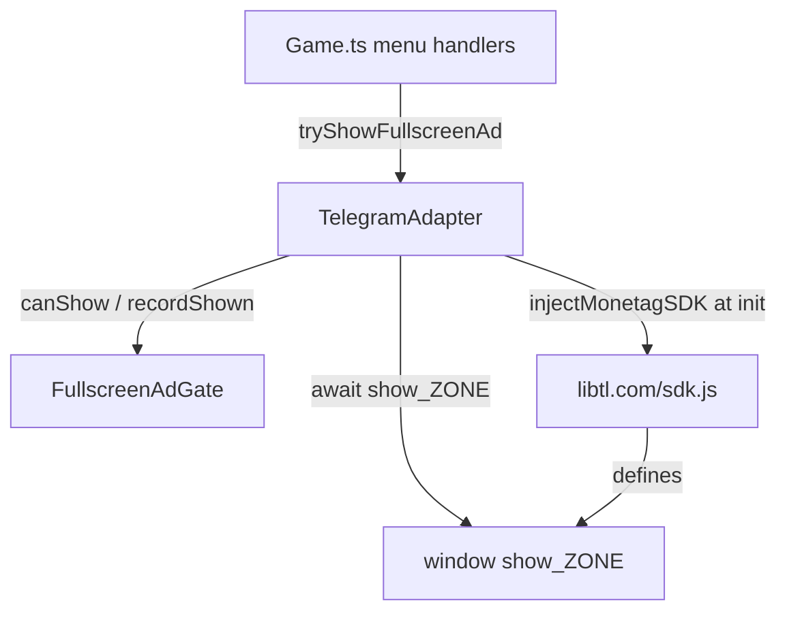

# Requirements

### Overview & Goals
Integrate the Monetag **rewarded interstitial** ad SDK (zone `show_10955089`) into the Telegram Mini App build of Chapayev Checkers. The rewarded interstitial (`show_10955089().then(...)`) is shown on-demand at the existing ad trigger points (matchmaking, local game start, private room open) — mirroring the Yandex "show ad before matchmaking" strategy — replacing the current no-op `tryShowFullscreenAd()` implementation in `TelegramAdapter`. The "reward" granted after the ad is proceeding into the requested game flow.

### Scope
**In Scope**
- Load the Monetag SDK (`libtl.com/sdk.js`, zone `10955089`, sdk function `show_10955089`) dynamically inside `TelegramAdapter.init()`.
- Implement `TelegramAdapter.tryShowFullscreenAd()` to await the rewarded interstitial `show_10955089()` (resolving its Promise = ad watched / reward earned), gated by the shared `FullscreenAdGate` cooldown.
- Make the zone id configurable via a new `VITE_MONETAG_ZONE` env variable (default `10955089`).
- Update `.env.example` with documentation for the new variable.

**Out of Scope**
- Enabling the SDK on Yandex, Capacitor, or standalone platforms (Telegram only).
- Firing Monetag's automatic `type:'inApp'` session mode (see note below).
- Any server-side reward validation or in-game bonus currency — the only "reward" is proceeding into the requested flow, consistent with the existing behavior.

### User Stories
- As a player using the Telegram Mini App, I watch a rewarded interstitial when I start matchmaking, start a local game, or open a private room — no more than once per cooldown window — after which I proceed into the requested flow, so that the game remains monetized without being spammy.
- As a developer, I can change the Monetag zone id via an environment variable without touching source code.

### Functional Requirements
- The Monetag SDK script is injected exactly once per session, only when running under Telegram, and only after `init()` runs.
- `tryShowFullscreenAd()` resolves `true` when an ad was shown, `false` when skipped (cooldown active), the SDK is unavailable, or an error/rejection occurs.
- The 90s `FullscreenAdGate` cooldown continues to apply, consistent with `YandexAdapter`.
- All SDK access is wrapped in try/catch and must never throw into the game loop.

### Non-Functional Requirements
- Script loading is non-blocking and failure-tolerant: an SDK load failure must not break `init()` or the game.
- No SDK calls are made from the ECS `Simulation.step()` / `System.update()` loop (calls originate only from `Game.ts` menu handlers, which already run outside the tick).

### Note on Monetag ad modes
Monetag exposes several modes for the same zone function. The originally provided snippet was the *automatic* in-app session mode (`show_10955089({ type:'inApp', inAppSettings:{...} })`). Per the latest decision, this build uses the **rewarded interstitial** mode instead: `show_10955089().then(reward)`, awaited at the existing menu actions. Because the trigger handlers in `Game.ts` already `await tryShowFullscreenAd()` and then unconditionally proceed, the rewarded "then" callback maps directly onto the game continuing into matchmaking / local / private-room — no separate reward payload is required.

# Technical Design

### Current Implementation
- `chapaev/src/platform/PlatformAdapter.ts` defines the `PlatformAdapter` interface, including `tryShowFullscreenAd(): Promise<boolean>`.
- `chapaev/src/platform/TelegramAdapter.ts` implements the interface; `tryShowFullscreenAd()` currently just `return false;` (lines 194–196).
- `chapaev/src/platform/YandexAdapter.ts` is the reference implementation: it dynamically injects an SDK `<script>` (`injectSDKScript()`, lines 163–193), holds a `FullscreenAdGate` instance, and wraps the SDK ad call in a Promise with a cooldown check (lines 87–127).
- `chapaev/src/platform/FullscreenAdGate.ts` provides the shared 90s cooldown policy (`canShow()` / `recordShown()`).
- `chapaev/src/core/Game.ts` calls `this.platform.tryShowFullscreenAd()` at three trigger points: `openPrivateMatchAfterAd()`, `startLocalAfterAd()`, `handleFindMatch()` (lines 233–246).
- `chapaev/index.html` loads third-party scripts (Yandex.Metrika) and a synchronous Telegram pre-bootstrap block.

### Key Decisions
- **Rewarded interstitial (confirmed):** wire `tryShowFullscreenAd()` to `await show_10955089()` (rewarded interstitial mode) rather than firing Monetag's automatic `type:'inApp'` session. The resolved Promise signals the ad was watched; the awaiting `Game.ts` handler then proceeds into the flow (the "reward"). This reuses the existing, well-tested ad trigger points and cooldown gate and mirrors the Yandex before-matchmaking strategy.
- **Telegram-only scope (confirmed):** the SDK is injected only inside `TelegramAdapter.init()`, so Yandex/standalone/Capacitor sessions are unaffected.
- **Dynamic script injection (confirmed):** mirror `YandexAdapter.injectSDKScript()` with a module-level promise guard, keeping the SDK out of `index.html` and out of non-Telegram builds.
- **Configurable zone via env:** read `VITE_MONETAG_ZONE` (default `10955089`) so the zone and its derived global function name (`show_<zone>`) are not hardcoded.

### Proposed Changes
1. **`TelegramAdapter.ts`**
   - Import `FullscreenAdGate` and add a `private readonly monetagAdGate = new FullscreenAdGate();` field.
   - Add a module-level `let monetagScriptPromise: Promise<void> | null = null;` and a `injectMonetagSDK()` method modeled on Yandex's `injectSDKScript()`:
     - Resolve the zone from `import.meta.env['VITE_MONETAG_ZONE']` (fallback `'10955089'`).
     - Create `<script src="//libtl.com/sdk.js" data-zone="<zone>" data-sdk="show_<zone>">`, `async`, with a stable element id (e.g. `monetag-sdk`).
     - Resolve on `load`, reject (and reset the promise) on `error`; reuse an existing script tag if present.
   - Call `await this.injectMonetagSDK();` near the end of `init()`, wrapped in try/catch so a load failure is non-fatal.
   - Replace the `tryShowFullscreenAd()` body (rewarded interstitial):
     - Return `false` early if `!this.monetagAdGate.canShow()`.
     - Look up the global `show_<zone>` function on `window`; if missing, warn and return `false`.
     - `await show_<zone>()` inside try/catch — resolution means the rewarded ad was watched; call `this.monetagAdGate.recordShown()` and return `true`. On throw/reject return `false`.
     - The `Game.ts` caller then proceeds into the requested flow regardless of result, so the "reward" (entering matchmaking / local / private room) is always granted.
2. **`.env.example`**: add `VITE_MONETAG_ZONE=10955089` with an explanatory comment.

### Data Models / Contracts
```ts
// Global injected by the Monetag SDK, keyed by zone id.
type MonetagShowFn = (options?: MonetagInAppOptions) => Promise<void>;

// TelegramAdapter
private readonly monetagAdGate = new FullscreenAdGate();
private injectMonetagSDK(): Promise<void>; // dynamic <script> loader, memoised
async tryShowFullscreenAd(): Promise<boolean>; // awaits rewarded interstitial window['show_<zone>']()
```

### File Structure
- Modified: `chapaev/src/platform/TelegramAdapter.ts`
- Modified: `chapaev/.env.example`
- Unchanged (reused): `chapaev/src/platform/FullscreenAdGate.ts`, `chapaev/src/core/Game.ts`, `chapaev/src/platform/PlatformAdapter.ts`

### Architecture Diagram


### Risks
- **Global name coupling:** the SDK exposes `show_<zone>`; deriving the name from `VITE_MONETAG_ZONE` must exactly match `data-sdk`. Mitigation: derive both from the same zone value.
- **Ad-blockers / offline:** `libtl.com/sdk.js` may fail to load; handled by non-fatal try/catch and the missing-global guard returning `false`.
- **Promise never resolving:** if Monetag's Promise hangs, the awaiting menu handler waits before proceeding. Mitigation is out of scope but a timeout wrapper could be added later if observed.

# Testing

### Validation Approach
Since ad rendering cannot be verified headlessly, validation focuses on type-safety, build integrity, and guarded runtime behavior via manual/console checks under a Telegram session.

### Key Scenarios
- **Build & typecheck:** the project compiles (`tsc` / Vite build) with the new `TelegramAdapter` changes and no type errors.
- **Script injection:** under Telegram, the `monetag-sdk` `<script>` tag is present in the DOM after `init()` and `window['show_10955089']` becomes a function.
- **Rewarded show:** triggering matchmaking / local start / private room calls `tryShowFullscreenAd()`, which awaits the Monetag rewarded interstitial Promise and returns `true` when the ad is watched; the caller then proceeds into the flow.
- **Cooldown:** a second trigger within 90s returns `false` without calling the SDK.

### Edge Cases
- SDK script fails to load → `init()` still completes; `tryShowFullscreenAd()` returns `false` (missing global guard).
- Non-Telegram platforms (Yandex/standalone/Capacitor) never inject the Monetag script.
- Monetag Promise rejects → `tryShowFullscreenAd()` catches and returns `false`; cooldown is not recorded.

### Test Changes
No existing automated tests cover the platform adapters' ad path; no unit tests are added. Verification is via build success and manual Telegram-session console inspection.

# Delivery Steps

###   Step 1: Inject the Monetag SDK in TelegramAdapter.init()
The Monetag SDK is dynamically loaded once per Telegram session and exposes the show_<zone> global.

- Add a module-level `monetagScriptPromise` guard and an `injectMonetagSDK()` method in `chapaev/src/platform/TelegramAdapter.ts`, modeled on `YandexAdapter.injectSDKScript()`.
- Resolve the zone from `import.meta.env['VITE_MONETAG_ZONE']` with fallback `'10955089'`.
- Create an `async` `<script src="//libtl.com/sdk.js" data-zone="<zone>" data-sdk="show_<zone>">` with a stable id `monetag-sdk`, reusing an existing tag if present; resolve on load, reject and reset the promise on error.
- Call `await this.injectMonetagSDK()` near the end of `init()`, wrapped in try/catch so load failures are non-fatal.
- Add `VITE_MONETAG_ZONE=10955089` with an explanatory comment to `chapaev/.env.example`.

###   Step 2: Implement rewarded interstitial in tryShowFullscreenAd()
TelegramAdapter shows a Monetag rewarded interstitial on menu actions, gated by the shared cooldown, after which the caller proceeds into the flow.

- Import `FullscreenAdGate` and add a `private readonly monetagAdGate = new FullscreenAdGate();` field to `TelegramAdapter`.
- Replace the `return false;` body of `tryShowFullscreenAd()`: return `false` early when `!this.monetagAdGate.canShow()`.
- Look up `window['show_<zone>']`; if it is not a function, warn and return `false`.
- `await show_<zone>()` (rewarded interstitial) inside try/catch; a resolved Promise means the ad was watched — call `this.monetagAdGate.recordShown()` and return `true`; on throw/reject return `false`.
- Confirm the existing trigger points in `chapaev/src/core/Game.ts` (`openPrivateMatchAfterAd`, `startLocalAfterAd`, `handleFindMatch`) proceed into the flow after the awaited call (the reward), matching the Yandex before-matchmaking strategy, and verify the project builds/typechecks.